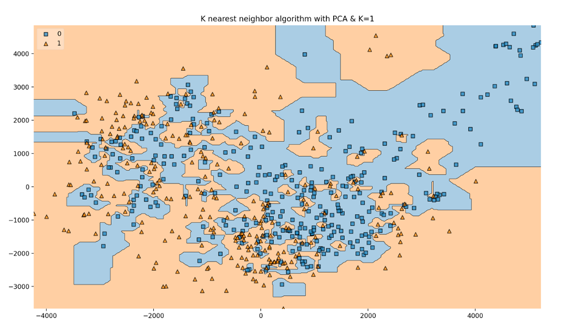

# Classifying Covid CT scans

This is my submission for the [CT diagnosis of Covid-19 challenge](https://covid-ct.grand-challenge.org/CT-diagnosis-of-COVID-19/). I used machine learning to take in chest CT images (from [this repostory](https://github.com/UCSD-AI4H/COVID-CT), which contains 748 Chest CT Images from a senior radiologist in Wuhan) and classify them as either having or not having covid.

# Results

I used a K nearest neighbor classifier on the raw image data from the covid scans to train my model. I used 80% of the images for training my model and 20% for testing it at the end. After fine-tuning the hyperparameters, **I ended up with an accuracy of 85.33%.**

This was also tested with a deep learning convolutional neural network. However, it performed even worse, at 67%. This is most likely due to limited data.

# Why does this matter

Covid tests are ineffecient and in shortage, taking anywhere from a few days to a week (not so much in 2021 but in early 2020 this was very much the case). CT scans on the other hand, only take 10-30 minutes with results able to be seen immidietely. CT scans could solve this testing problem if a high enough accuracy is obtained.

Moreover, CAT scans have a utilization rate of 31% according to a 2017 study from the Mathews Journal of Emergency Medicine. There are about 7,000 machines in the US and they are sitting idle 69% of the time, so the equipment and bandwidth is available.

# Dependencies

If you wish to run the script, you'll need Python 3.7 with the following modules:

- Tensorflow
- Keras
- Matplotlib
- Sklearn
- mlxtend
- imutils
- numpy
- cv2
